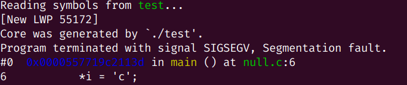
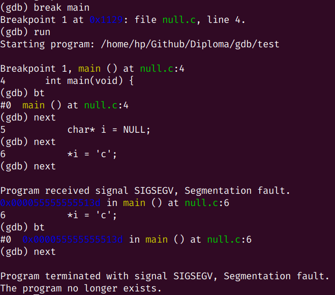

# Модуль ядра 

Версия ядра: `uname -r`. 

Все модули находятся в папке `/lib/modules/`, а информация о загруженных модулях хранится в файле `/proc/modules`.

## Модуль, который при загрузке и выгрузке пишет сообщение о действиях

Модуль `lkm_example.c` пишет в журнал ядра сообщение о его загрузке и выгрузке, соответственно.

`Makefile` компилирует и тестирует модуль: команды`insmod` и `rmmod` загружают и удаляют модуль, соответственно. Для просмотра журнала ядра используется `dmesg` или `lsmod`. 

Флаг `-C` команды `dsemg`, он же `--clear`, очищает журнал, а флаг `-c`, он же `--read-clear`, печатает содержимое журнала и после очищает его.

# Shared library

Создадим объектный файл, указав опцию PIC (Position Independent Code), Warning (-Wall - warning all), -g для добавления дебаг-информации и -c для создания только файла библиотеки, без вызова линкера:
```
gcc -fPIC -Wall -g -c libhello.c
```
Появится объектный файл с расширением `.o`.

Далее создадим общую библиотеку с дебагом (-g), тип общая (-shared), использовав объектный файл libhello.o:
```
gcc -g -shared -o libhello.so libhello.o -lc
```
Создалась общая библиотека `libhello.so`.

## Линковка приложения с библиотекой

Собираем программу, указав через -l — имя библиотеки (без lib), и с помощью -L — путь, по которому необходимо искать файл библиотеки:
```
gcc hello.c -o hello -lhello -L.
```

Добавляем текущий каталог в `$LD_LIBRARY_PATH`:
```
export LD_LIBRARY_PATH=$LD_LIBRARY_PATH:.
```

Проверить используемые программой библиотеки можно с помощью `ldd`:
```
ldd hello
```

## Ручная загрузка библиотеки приложением (dlopen/dlsym)

### Описание работы

Для реализации динамической загрузки существует интерфейс динамической загрузки (Dynamic Loading API), дающий приложению пользователя возможность использовать совместно используемые библиотеки. Этот интерфейс невелик, однако он реализует все необходимое, беря всю "черную" работу на себя.

`dlopen` — дает программе доступ к ELF-библиотеке

`dlsym`	— возвращает адрес функции из библиотеки, загруженной при помощи dlopen

`dlerror` — возвращает текстовое описание последней возникшей ошибки

`dlclose` — закрывает доступ к библиотеке

Вначале приложение вызывает dlopen, передавая в параметрах имя файла и режим. Функция возвращает дескриптор, который будет использоваться в дальнейшем. Режим указывает компоновщику, когда производить перемещение. Возможные варианты – RTLD_NOW (сделать все необходимые перемещения в момент вызова dlopen) и RTLD_LAZY (перемещения по требованию). В последнем случае работают внутренние механизмы, при которых каждое первое обращение к библиотечной функции перенаправляется динамическому компоновщику и происходит перемещение. Последующее обращение к той же функции уже не требует повторного перемещения.

`dlopen` возвращает дескриптор, используемый для дальнейшей работы с библиотекой.
```
#include <dlfcn.h>
void *dlopen( const char *file, int mode );
```

По дескриптору с помощью функции `dlsym` находятся адреса символов библиотеки. Функция принимает в качестве параметра дескриптор и строковое имя символа и возвращает искомый адрес: 
```
void *dlsym( void *restrict handle, const char *restrict name );
```

Если при работе этих функций возникла ошибка, ее текстовую формулировку можно получить при помощи `dlerror`. Эта функция не имеет входных аргументов и возвращает строку, если ошибка была, и `NULL`, если ошибки не было: 
```
char *dlerror();
```

Если работа с библиотекой закончена и приложению больше не нужны ни дескриптор, ни ее функции, программист может вызвать `dlclose`. Все адреса, полученные ранее при помощи dlsym, становятся недействительными. 
```
char *dlclose( void *handle );
```

### Пример

Реализуем оболочку, позволяющую оператору задавать исходное имя библиотеки, имя функции и аргумент. Другими словами, пользователь сможет вызывать любую функцию из произвольной библиотеки, не скомпонованной предварительно с приложением. Адрес функции находится посредством рассматриваемого API, после чего она вызывается с заданным аргументом и возвращает результат.

Для сборки файла `dl.cpp` используем следующую команду:
```
g++ -rdynamic -o dl dl.cpp -ldl  
```
Опция `-rdynamic` указывает компоновщику включить в динамическую таблицу символов результирующего файла все символы, что позволит видеть стек вызовов при работе с dlopen. Опция `-ldl` означает компоновку с библиотекой libdl.

Запускаем программу командой:
```
./dl libhello.so print_hello    
```

# Cигналы (man -a signal, man kill)

Программа в которой отлавливаем два сигнала: `SIGINT` и `SIGTERM`.
```
gcc -Wall -O2 -o test sigint.c
```

Получить сигнал `SIGINT` можно, нажав `ctrl-c`. Для получения сигнала `SIGTERM` следует использовать команду `kill -15 pid` (параметр `-15` опциональный), где `pid` выводится программой раз в секунду.

# Отладчик gdb

Обратимся по нулевому указателю в `null.c`. Соберем файл:
```
gcc -g null.c -o test
```

Просмотреть все виды ограничений:
```
ulimit -a
```

Нас интересует `core file size`, поэтому уточним команду:
```
ulimit -c
```

Изменим жесткое ограничение:
```
ulimit -c unlimited
```
Аналогично мягкое:
```
ulimit -S -c unlimited 
```

Запустив файл, мы получим segfault:
```
[1]    55172 segmentation fault (core dumped)  ./test
```

В исходном репозитории создастся coredump-файл `core`. С помощью `gdb` можно прочитать `core dump`:
```
gdb test core
```


С помощью gdb получим 'stack trace' из coredump-а (команда bt):
```
gdb test
```


# Символьный файл устройства (character special file)

To create a device type file, use the mknod command; the command receives the type (block or character), major and minor of the device (mknod name type major minor). Thus, if you want to create a character device named mycdev with the major 42 and minor 0, use the command:
```
mknod /dev/mycdev c 42 0
```

Add character device to the module. Implement 'open', 'read', 'write', 'release' functionality. Device shall operate in 'echo' mode. Data passed to 'write' shall be returned from 'read'. Establish meaningful limits to prevent device 'abuse'.

Verify operation executing the following commands in two terminals:
    cat > /dev/echo
    cat < /dev/echo
Text typed in first terminal shall appear in second terminal.

Try to transfer big binary file through 'echo' device. Verify that received copy matches sent file.

Чтение воводится бесконечное число раз
Вход только одному процессу позволен
# Новая задача

https://www.kernel.org/
git://git.kernel.org/pub/scm/linux/kernel/git/torvalds/linux.git
git://git.kernel.org/pub/scm/linux/kernel/git/stable/linux-stable.git
https://git.kernel.org/pub/scm/linux/kernel/git/tglx/history.git
https://bootlin.com/doc/training/linux-kernel/linux-kernel-slides.pdf
linux/Documentation/process/coding-style.rst
https://lwn.net/Kernel/LDD3/


Implement multi-threaded application consisting of several 'producer' and several 'consumer' threads. Number of produces and consumers shall be passed via command line arguments. Use random numbers as produced and consumed 'data'. Develop necessary data structures to store produced 'data' waiting for consumption. Don't forget about synchronization. Use 'busy loop' for random time to simulate delay in producers and consumers.


Study 'unix sockets' (man unix, man -a socket). Develop 'client' and 'server' applications communicating via 'unix socket'. 'server' shall operate in 'echo' mode. Data received by 'server' shall be returned to the same 'client'. 'client' shall read data from 'stdio' and write it to 'socket'. 'client' shall read data from 'socket' and write it to 'stdout'. Several simultaneously connected clients shall be supported.

In different terminals launch server and couple of clients. Text typed in client shall be printed in the same terminal. Do some processing of the text on server side to make obvious that text printed on client side was actually received from server.

Acronis is international company. English is official language in Acronis. All documentation and comments in source code must be written in English.


https://github.com/acroteam/lib-proxy
https://github.com/acroteam/tracker
присоединяйтесь. присылайте пулл реквесты.
задача каждого добиться принятия своего пулл реквеста и раскритиковать пулл реквесты коллег, чтобы они не были приняты. ;-)


Install 'debug kernel'. Do something 'prohibited' in your kernel module (for example try to allocate memory holding spinlock locked). Check if 'debug kernel' detects and reports your violation.
https://github.com/acroteam/tracker/pull/1


https://github.com/acroteam/Checker
есть некий ядерный модуль (например, https://github.com/acroteam/tracker)
при любом изменении исходников нужно пересобрать модуль на множестве дистрибутивов и множестве версий ядра.